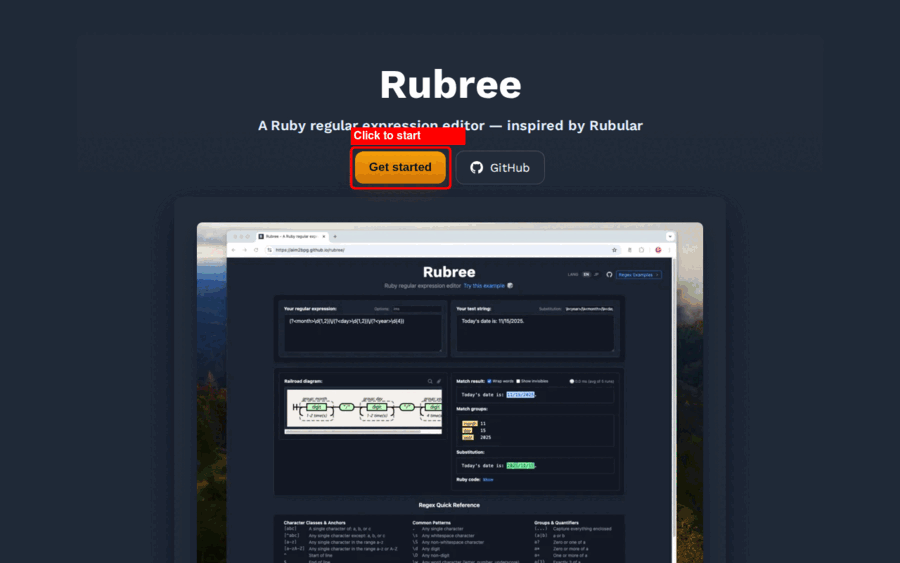

# Rubree

A Ruby-based regular expression editor.

Inspired by: https://rubular.com


## Usage



| Step | Action | What happens |
|---|---|---|
| 1 | Click **Get started** | Opens the Terms of Service modal |
| 2 | Click **Agree and Start** | Boots the Ruby WASM runtime (~10 s on first visit) |
| 3 | Enter a regex in **Your regular expression** | Railroad diagram renders instantly |
| 4 | Enter text in **Your test string** | Matches are highlighted in real time |
| 5 | Click 🔍 on the diagram | Enlarge the railroad diagram in a modal |
| 6 | Enter `\1!` in **Substitution** | Preview substitution result (`hello! world! foo`) |
| 7 | Click the share icon (↗) | Copies a permalink to clipboard |

---

## Technology stack

### ⚙️ Backend

- [Ruby](https://www.ruby-lang.org/de/) 4.0
  > Ruby 4.0 WASM builds require source patches and runtime workarounds.
  > See [WASM Build Notes](docs/wasm-build-notes.md) for details.
- [Ruby on Rails](https://rubyonrails.org/) 8.1
- [Regexp::Parser](https://github.com/ammar/regexp_parser/) a regular expression parser library for Ruby

### 🎨 Frontend

- [Hotwire](https://hotwired.dev/) for building the frontend without using much JavaScript by sending HTML instead of JSON over the wire
- [TailwindCSS](https://tailwindcss.com/) to not have to write CSS at all
- [RailroadDiagrams](https://github.com/ydah/railroad_diagrams) a tiny Ruby+SVG library for drawing railroad syntax diagrams like JSON.org

### 🛠️ Development

- [Foreman](https://github.com/ddollar/foreman/) for jsbundling-rails, cssbundling-rails
- [Lefthook](https://github.com/evilmartians/lefthook/) Fast and powerful Git hooks manager for any type of projects
- [Dev Containers](https://containers.dev/) reproducible development environment via `.devcontainer/`
- [Claude Code](https://claude.ai/code) AI coding agent for development assistance

### 🧹 Linting and testing

- [Rubocop](https://rubocop.org/) the Ruby Linter/Formatter that Serves and Protects
- [ERB Lint](https://github.com/Shopify/erb_lint/) Lint your ERB or HTML files
- [Biome](https://biomejs.dev/) Format, lint, and more in a fraction of a second
- [RSpec](https://rspec.info/) for Ruby testing
- [Playwright](https://playwright.dev/) for E2E testing
- [Octocov](https://github.com/k1LoW/octocov) octocov is a toolkit for collecting code metrics

### 🚀 Build and Deployment

- [Wasmify Rails](https://github.com/palkan/wasmify-rails/) — Build Rails apps into WebAssembly so the application can run in the browser
- [GitHub Pages](https://docs.github.com/en/pages/) — Host the generated static site (Wasm bundles and assets) as the deployment target

### 🤖 Shift-left security

- [Dependabot](https://github.com/dependabot/) automated dependency updates built into GitHub
- [Gitleaks](https://github.com/gitleaks/gitleaks/) Find secrets with Gitleaks
- [Brakeman](https://github.com/presidentbeef/brakeman/) a static analysis security vulnerability scanner for Ruby on Rails applications

### ▶️ CI/CD Tool

- [GitHub Actions](https://docs.github.com/en/actions/) for testing, linting, and building web application and deploy to GitHub Pages

## Getting started

```
git clone https://github.com/aim2bpg/rubree.git
cd rubree
bin/setup
```

Then open http://localhost:3000 in your browser.

For Dev Container setup, linting, running tests against different browser drivers, and testing
the WASM deployment locally, see [Development Guide](docs/development.md).

For an annotated walkthrough of every feature, see [Usage Guide](docs/usage-guide.md).

## Browser Compatibility

Rubree currently supports **Chrome** and **Edge** only.

### Why are Safari and Firefox not supported?

Safari and Firefox have compatibility limitations with Ruby WebAssembly (Wasmify Rails):

- **Safari**: Ruby Wasm crashes during execution due to WebAssembly asyncify incompatibility
  - Error: `RangeError: Maximum call stack size exceeded`
  - The Ruby WebAssembly runtime crashes when trying to initialize Rails
  
- **Firefox**: Service Worker script evaluation fails
  - Error: `TypeError: ServiceWorker script evaluation failed`
  - The Service Worker script cannot be evaluated in Firefox's stricter module evaluation

These are fundamental limitations of how Safari and Firefox handle WebAssembly features required by Wasmify Rails. For more details, see [wasmify-rails Issue #7](https://github.com/palkan/wasmify-rails/issues/7).

When accessing Rubree from Safari or Firefox, you will see a warning banner with detailed console error logs for troubleshooting.

## Roadmap

Rubree already covers the core editing/visualization/sharing experience — pattern matching,
capture groups, railroad diagrams, substitution preview, Ruby code snippets, permalinks, and
ReDoS checks. For the full feature checklist and the supported `Regexp::Parser` syntax scope used
for railroad diagram generation, see [Roadmap](docs/roadmap.md).

## Contributing

Bug reports and pull requests are welcome on GitHub at https://github.com/aim2bpg/rubree

## License

This project is licensed under the MIT License, see the LICENSE file for details

## Articles & Announcements

- **X (Twitter) — Launch announcement (2025-11-24)**
  - https://x.com/aim2bpg/status/1992926501482983803

- **はてなブログ — Ruby × Rails × Wasm で動く正規表現エディタ Rubree をリリースしました (2025-11-24)**
  - https://aim2bpg.hatenablog.com/entry/2025/11/25/083000

- **Qiita — Rubular を現代化した正規表現エディタ「Rubree」をリリースしました (2025-11-24)**
  - https://qiita.com/aim2bpg/items/3190cf503456f231b78b

- **DEV.to — Rubree: A Modern Ruby Regex Editor Running Fully in Your Browser (2025-11-24)**
  - https://dev.to/aim2bpg/rubree-a-modern-ruby-regex-editor-running-fully-in-your-browser-5g2b

- **Ruby Weekly #​777 (2025-11-27)**
  - https://rubyweekly.com/issues/777#:~:text=Rubree

- **正規表現エディタ「Rubree」を紹介 - Railsチュートリアル note マガジン (2025-12-03)**
  - https://note.com/yasslab/n/ncb57c9812545

- **関西Ruby会議09 — Project Naraku 外伝 —— レールロード図で照らすOnigmoのバグ (2026-07-18)**
  - https://speakerdeck.com/aim2bpg/project-naraku-wai-chuan-rerurodotu-dezhao-rasuonigmonobagu
