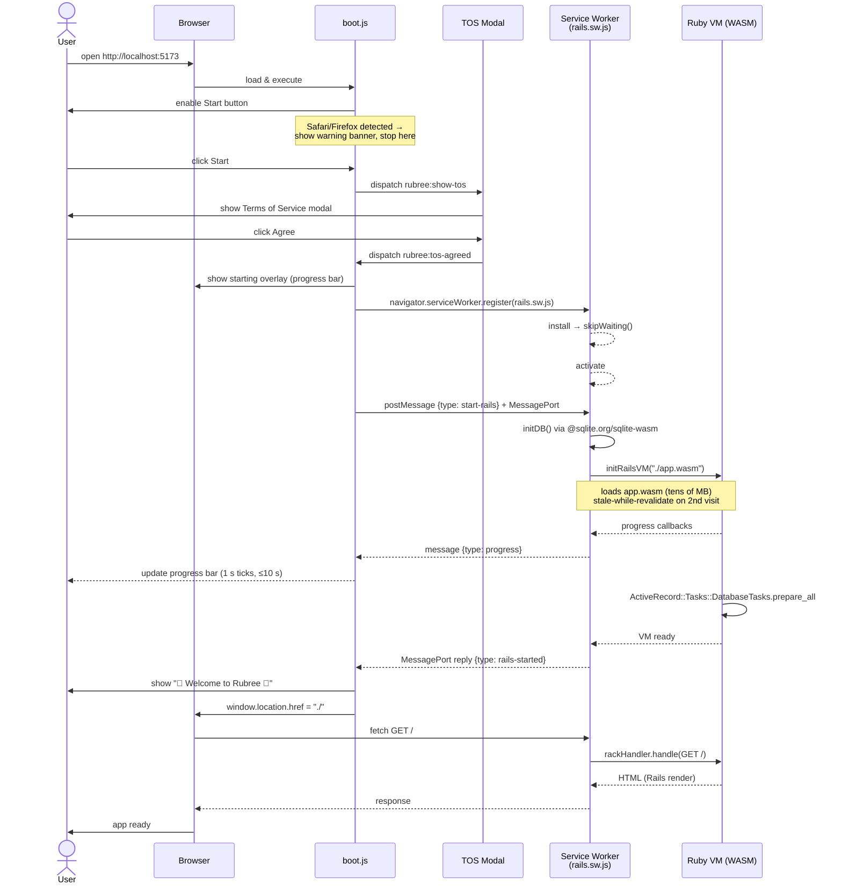
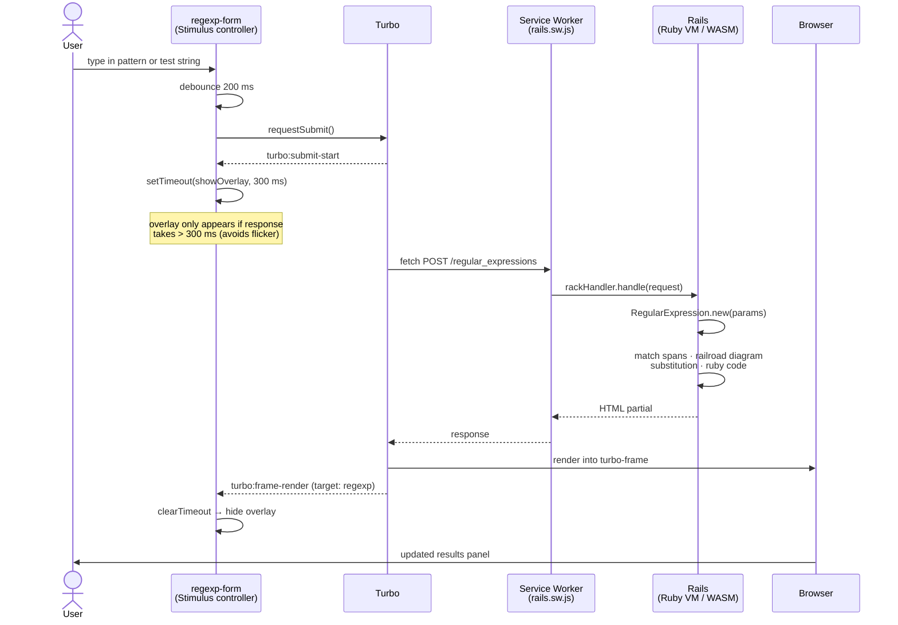

# Development Guide

Setup, linting, and test commands for working on Rubree locally.

## Getting started

### Using Dev Container (recommended)

1. Clone the repo and open in [VS Code](https://code.visualstudio.com/) with the
   [Dev Containers extension](https://marketplace.visualstudio.com/items?itemName=ms-vscode-remote.remote-containers).
   Select **Reopen in Container** — Ruby, Node.js, Rust, and `gh` are set up automatically.

2. (Optional) Install Claude Code automatically when the container is created:

   ```sh
   touch .install-claude-code   # gitignored, scoped to this clone
   ```

   `setup.sh` detects this marker file and runs the installer when the container builds.
   Or install manually inside the container:

   ```sh
   curl -fsSL https://claude.ai/install.sh | bash
   ```

### Manual setup (without Dev Container)

```sh
bin/setup          # installs gems and npm packages, starts the app
open http://localhost:3000
```

Optional:

```sh
brew install lefthook && lefthook install
brew install gitleaks
```

---

## GitHub CLI

`gh` is installed in the Dev Container. SSH key auth handles `git push/pull` automatically,
but `gh` needs a separate token for GitHub API operations.

**Authenticate once** after the container is created:

```bash
gh auth login
```

When prompted, follow the device flow below (recommended answers shown):

```
? Where do you use GitHub? GitHub.com
? What is your preferred protocol for Git operations on this host? SSH
? Upload your SSH public key to your GitHub account? /home/vscode/.ssh/id_ed25519.pub
? Title for your SSH key: GitHub CLI
? How would you like to authenticate GitHub CLI? Login with a web browser

! First copy your one-time code: XXXX-XXXX
Press Enter to open https://github.com/login/device in your browser...
(node:XXXXX) [DEP0169] DeprecationWarning: `url.parse()` ...   ← ignore this
✓ Authentication complete.
- gh config set -h github.com git_protocol ssh
✓ Configured git protocol
! Authentication credentials saved in plain text              ← stored in ~/.config/gh/hosts.yml, normal
✓ SSH key already existed on your GitHub account: /home/vscode/.ssh/id_ed25519.pub
✓ Logged in as <your-username>
```

Open `https://github.com/login/device`, enter the one-time code, and the terminal will complete automatically.
After authentication, verify with `gh auth status`.

> If you prefer not to use browser auth, set `GH_TOKEN` to a fine-grained PAT in your host shell
> profile and add `"GH_TOKEN": "${localEnv:GH_TOKEN}"` to `devcontainer.json` → `remoteEnv`.

**Tool priority for Claude Code:**

| Tool | When to use |
|---|---|
| `gh` | All GitHub operations when authenticated — `gh pr create`, `gh run list`, `gh api repos/...` |
| `WebFetch` | Public GitHub content only (raw files, public pages) when `gh` is not authenticated |

---

## Autonomous overnight operation

Claude Code can run autonomously (write code, run tests, commit) using a `.steering/` task plan.

### What is protected

| Protection | Mechanism |
|---|---|
| Force-push to `main`/`master` | PreToolUse hook → deny |
| Secrets: `.env`, `master.key`, `.ssh/**` via Read tool | `deny` in `settings.json` |
| SSH private key read via Bash (`cat ~/.ssh/id_*`) | `deny` in `settings.json` |
| Pipe-to-shell downloads (`curl \| sh`, `wget \| bash`) | `deny` in `settings.json` |
| Netcat/socat exfiltration (`nc`, `ncat`, `socat`) | `deny` in `settings.json` |
| `--dangerouslySkipPermissions` bypass | `disableBypassPermissionsMode: "disable"` |
| Publishing packages, state-changing `gh` commands | `ask` in `settings.json` |

### What is NOT sandboxed

| Capability | Notes |
|---|---|
| `git push` to any non-main branch | Scope via `.steering/` plan; add to `ask` for extra caution |
| Outbound HTTP/HTTPS | npm install, curl downloads, API calls all work |
| `ssh` direct connections | In `ask` — requires approval |
| `npm install <new-package>` | In `ask` — approve each new package consciously |

### Known attack vectors

| Attack | Mitigation |
|---|---|
| Malicious project hooks (CVE-2025-59536) | Audit `settings.json` before running Claude Code in a cloned repo |
| InversePrompt — prompt injection via files Claude reads | Scope tasks with `.steering/` plan |
| Supply chain via `npm install` | `npm install <package>` is in `ask` |
| API key exfiltration | Set a spending cap on `ANTHROPIC_API_KEY` |
| Subcommand limit bypass | Mirror critical deny rules in `~/.claude/settings.json` on the host |

> CVE numbers from researcher reports (2025–2026). Verify against NVD before treating as authoritative.

**User-level settings** — project-level `settings.json` can be overridden by a malicious cloned
repo. Mirror critical denies in `~/.claude/settings.json` on the host machine:

```json
{
  "permissions": {
    "deny": [
      "Bash(curl * | sh*)",
      "Bash(curl * | bash*)",
      "Bash(nc *)",
      "Bash(ncat *)",
      "Bash(socat *)",
      "Bash(cat ~/.ssh/id_*)"
    ]
  }
}
```

### Browser verification

Use `/verify-wasm` — it automates the full sequence (WASM build → Vite start → Playwright MCP
headless golden-path check). See `.claude/commands/verify-wasm.md` for details.

If Playwright MCP is not connected in the current session, fall back to the manual steps in
[Test deployment locally (WASM build)](#test-deployment-locally-wasm-build) and verify in
Chrome yourself, or run the headless script directly:

```bash
node -e "
  const { chromium } = require('./node_modules/playwright');
  // ... or use docs/screenshots/golden-path/ as visual reference for expected state
"
```

---

## Running linters

```bash
bin/rubocop                   # Ruby
bin/erb_lint --lint-all       # ERB
bin/yarn biome check          # JS/TS
bin/brakeman --no-pager --skip-files app/assets/builds/,build/,node_modules/,pwa/,rubies/  # security
```

Auto-fix:

```bash
bin/rubocop -a
bin/erb_lint --lint-all -a
bin/yarn biome check --write && bin/yarn biome migrate --write
```

---

## Running tests

Rubree has two distinct test layers that cover different environments.

| | Layer 1 — RSpec system specs | Layer 2 — WASM E2E (planned) |
|---|---|---|
| **Command** | `bin/rspec` | `node bin/qa-wasm` |
| **Server** | Rails dev server (port 3000) | PWA dev server (port 5173) |
| **Ruby runtime** | Native process | WASM inside the browser |
| **What it covers** | Models, controllers, views, Stimulus JS | Regexp::Parser feature coverage, railroad diagrams, UI states |
| **WASM involved?** | No | Yes — production-equivalent environment |
| **Speed** | Fast (seconds) | Slow (~30 s WASM boot per session) |
| **In CI?** | ✅ `ci.yml` (every PR) | 🔲 Planned: `deploy.yml` post-pack, pre-Pages |
| **Local execution** | `bin/rspec` | Manual / Claude-suggested / Claude-delegated |

Both layers should pass before shipping any change that could affect the WASM runtime.

### Layer 1 — RSpec system specs (Rails dev server)

```bash
bin/rspec   # default: headless Playwright/Chromium
```

| What it tests | How it runs |
|---|---|
| Ruby logic, controllers, views, Stimulus JS | Playwright drives a **Rails dev server** on port 3000 |
| WASM is **not** involved | Ruby executes natively as a normal Rails process |
| Fast (seconds) | No WASM build required |

Override the driver with `DRIVER=<name>`:

```bash
DRIVER=playwright_chromium          bin/rspec   # Chromium with UI
DRIVER=playwright_chromium_headless bin/rspec   # Chromium headless
DRIVER=playwright_firefox           bin/rspec   # Firefox with UI
DRIVER=playwright_firefox_headless  bin/rspec   # Firefox headless
DRIVER=playwright_webkit            bin/rspec   # WebKit with UI
DRIVER=playwright_webkit_headless   bin/rspec   # WebKit headless
DRIVER=selenium_chrome              bin/rspec   # Selenium Chrome with UI
DRIVER=selenium_chrome_headless     bin/rspec   # Selenium Chrome headless
DRIVER=rack_test                    bin/rspec   # Rack Test (no JS)
```

### Layer 2 — WASM E2E test (PWA dev server)

```bash
# 1. Ensure a WASM build exists
bin/rails wasmify:build && bin/rails wasmify:pack   # skip if app.wasm is current

# 2. Start the PWA dev server
(cd pwa && npm run dev) &
sleep 5

# 3. Run the comprehensive Playwright script
node bin/qa-wasm
# Results → /tmp/rubree_test_results.json
```

> **`bin/qa-wasm` is not yet implemented.** The script is being developed under
> `.steering/20260607-ux-improvements/comprehensive_test.mjs` (gitignored) and will be moved
> here once stabilised. See `.steering/20260607-ux-improvements/tasklist.md` Phase 3.

| What it tests | How it runs |
|---|---|
| Full Regexp::Parser feature coverage, railroad diagrams, UI states | Playwright drives the **PWA dev server** on port 5173 |
| Ruby executes **inside the browser via WASM** | Production-equivalent environment |
| Slow (~30 s boot per session) | Requires a built `app.wasm` |

**When to run:** after `wasmify:build`, after gem updates, or when adding a new regex feature.
For a focused golden-path check, use `/verify-wasm` instead.

> **Status: local only.** This layer is documented here as a manual step and is not yet
> integrated into GitHub Actions. CI integration is planned as a post-pack step in `deploy.yml`
> so WASM regressions are caught before GitHub Pages deployment.
> See `.steering/20260607-ux-improvements/tasklist.md` for the integration plan.

**Expected impact on `deploy.yml` duration once integrated:**

| | Cache warm | Cache cold |
|---|---|---|
| Current deploy | ~3–4 min | ~18 min |
| After Layer 2 | ~5–6 min (+2 min) | ~23 min (+5 min) |

Cold builds are dominated by `wasmify:build` (~15 min), so Layer 2 is not the bottleneck.
The +2 min warm cost covers: root `npm install`, Playwright Chromium, Vite dev server start,
WASM boot (~30 s), and ~60 test cases at ~1 s each.

> **Token-efficient workflow:** run the script yourself; bring only the failing cases to Claude.
> The JSON results file makes it easy to filter: `jq -e '.summary.fails == 0' /tmp/rubree_test_results.json || jq '.results[] | select(.status=="fail")' /tmp/rubree_test_results.json`

---

## Test deployment locally (WASM build)

RSpec system specs run against the Rails dev server (port 3000) — they do **not** test the WASM
runtime. Use `/verify-wasm` for automated headless verification, or follow the manual steps below.

### 1. Build the WASM artefacts

```bash
bin/rails wasmify:build   # ~15 min cold, ~1 min with cache
bin/rails wasmify:pack
```

**Clean build** — delete intermediate artefacts first if you need a fully fresh build (e.g.
after changing gems or suspecting a stale cache):

```bash
rm -rf tmp/wasmify/        # intermediate artefacts: ruby.wasm, app-core.wasm, ruby-core.wasm
rm -f pwa/public/app.wasm  # final packed output
bin/rails wasmify:build
bin/rails wasmify:pack
```

If either command fails, check `docs/wasm-build-notes.md` before investigating.

### 2. Start the PWA dev server

```bash
cd pwa && npm run dev   # http://localhost:5173
```

Vite sets the required `Cross-Origin-Opener-Policy: same-origin` and
`Cross-Origin-Embedder-Policy: require-corp` headers automatically (`pwa/vite.config.js`).
Without them the WASM runtime silently fails to boot — do not remove them.

> Locally the app is served at `/`; on GitHub Pages at `/rubree/`. Controlled by `GITHUB_ACTIONS`
> env var in `vite.config.js`.

### 3. Open in Chrome and verify

Open **http://localhost:5173** in Chrome or Edge (not Safari or Firefox — see README).

1. Accept the Terms of Service modal
2. Wait for the WASM boot progress bar to complete
3. Verify: regex match highlighting, railroad diagram, substitution, Ruby code snippet, permalink

To force a cold re-boot: unregister the Service Worker in DevTools → Application → Service
Workers, then hard-refresh.

### Sequence diagrams

#### Boot sequence (first visit)



#### Request flow (after boot)



### References

- [Wasmify Rails](https://github.com/palkan/wasmify-rails?tab=readme-ov-file#step-2-binrails-wasmifybuildcore)
- [Ruby on Rails on WebAssembly, the full-stack in-browser journey](https://web.dev/blog/ruby-on-rails-on-webassembly?hl=ja#next_level_a_blog_in_15_minutes_in_wasm)
