# Rubree Usage Guide

A visual walkthrough of every feature in Rubree — annotated screenshots showing
exactly what to look for at each step. These images also serve as the **expected
visual state** for manual verification during WASM builds (see `/verify-wasm`).

> **Browser**: Chrome or Edge only. Safari / Firefox are not supported (see README).

---

## Table of Contents

1. [Getting Started](#1-getting-started)
2. [Basic Match & Execution Time](#2-basic-match--execution-time)
3. [Capture Groups](#3-capture-groups)
4. [Named Captures](#4-named-captures)
5. [Regex Options (flags)](#5-regex-options-flags)
6. [Railroad Diagram](#6-railroad-diagram)
7. [Substitution](#7-substitution)
8. [Ruby Code Snippet](#8-ruby-code-snippet)
9. [Regex Examples](#9-regex-examples)
10. [ReDoS Check](#10-redos-check)
11. [Permalink / Sharing](#11-permalink--sharing)
12. [Quick Reference](#12-quick-reference)

---

## 1. Getting Started

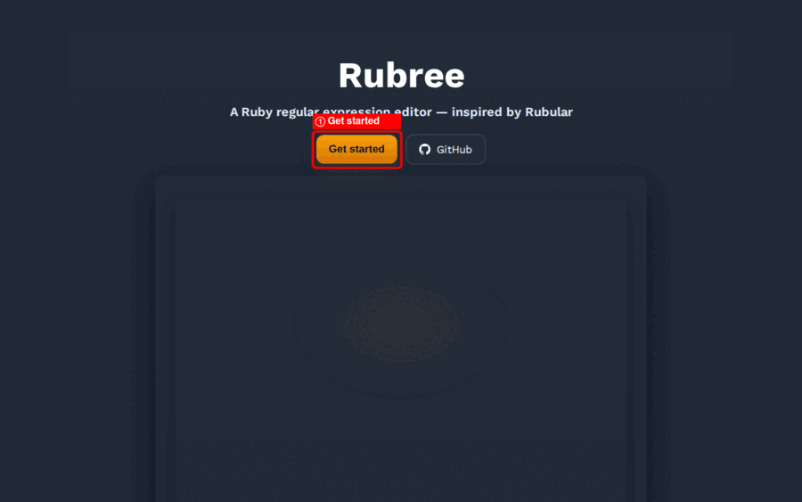

| Step | What to do | What you see |
|---|---|---|
| ① | Click **Get started** | Terms of Service modal opens |
| ② | Click **Agree and Start / 同意して開始** | Progress bar appears ("Starting Rubree — About 10 seconds") |
| ③ | Wait ~10 s | Boot completes; editor is ready |

The boot screen only appears on **first visit** — subsequent visits use the Service Worker
cache and launch instantly.

---

## 2. Basic Match & Execution Time

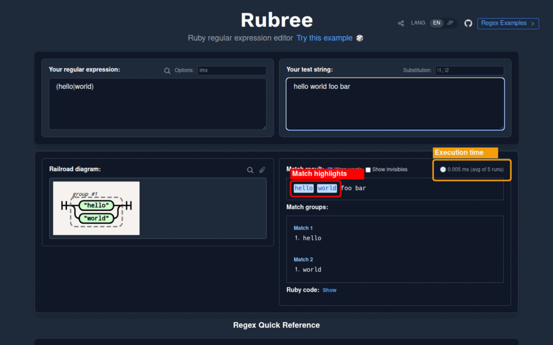

**Try it:**
- Pattern: `(hello|world)`
- Test string: `hello world foo bar`

**Expected:**
- `hello` and `world` are highlighted in the Match result area
- Execution time shown (e.g. `0.006 ms (avg of 5 runs)`)
- Match groups panel lists each match with its capture group values

---

## 3. Capture Groups

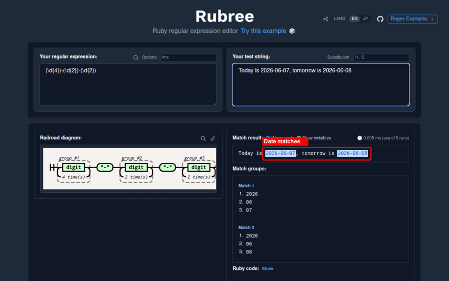

**Try it (numbered):**
- Pattern: `(\d{4})-(\d{2})-(\d{2})`
- Test string: `Today is 2026-06-07, tomorrow is 2026-06-08`

**Expected:**
- Both dates highlighted
- Match groups show `1. 2026`, `2. 06`, `3. 07` for each match

---

## 4. Named Captures

**Try it:**
- Pattern: `(?<year>\d{4})-(?<month>\d{2})-(?<day>\d{2})`
- Test string: `Today is 2026-06-07`

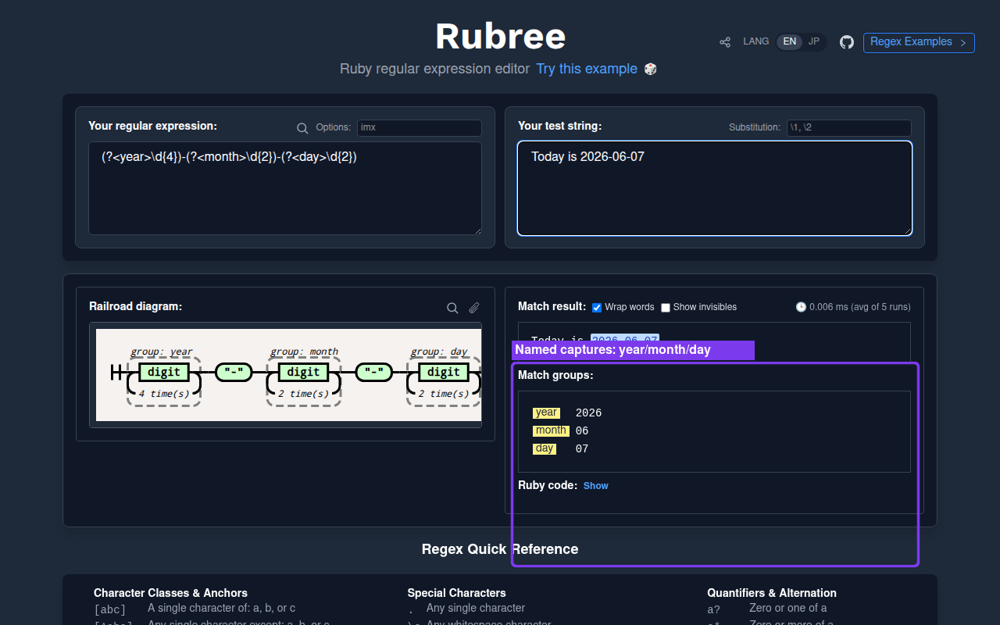

**Expected:**
- Match groups show named keys: `year 2026`, `month 06`, `day 07`
- Railroad diagram labels each group: `group: year`, `group: month`, `group: day`

---

## 5. Regex Options (flags)

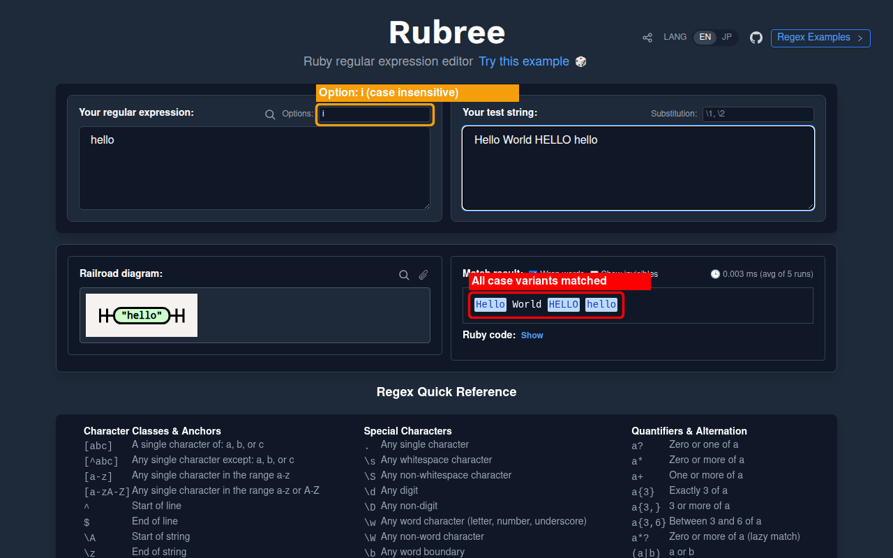

The **Options** field (top-right of the pattern panel) accepts Ruby regex flags:

| Flag | Meaning |
|---|---|
| `i` | Case insensitive |
| `m` | Multiline (`.` matches `\n`) |
| `x` | Extended — ignore whitespace, allow `# comments` |

**Try it:**
- Pattern: `hello`
- Options: `i`
- Test string: `Hello World HELLO hello`

**Expected:** All four variants highlighted — `Hello`, `HELLO`, `hello`, `hello`.

---

## 6. Railroad Diagram

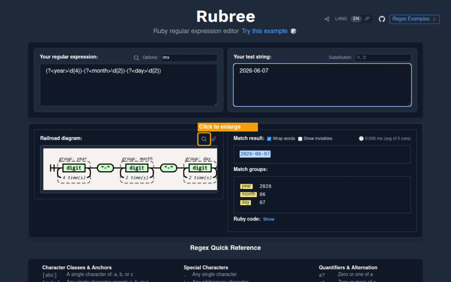

Every pattern renders a **railroad (syntax) diagram** in real time using
[railroad_diagrams](https://github.com/ydah/railroad_diagrams) (Ruby gem, runs in WASM).

- Click 🔍 to open the enlarged modal (`Regex: <pattern>` title)
- Click 📋 to copy the diagram as a PNG to clipboard

**Try it:**
- Pattern: `(?<year>\d{4})-(?<month>\d{2})-(?<day>\d{2})`

**Expected modal:**

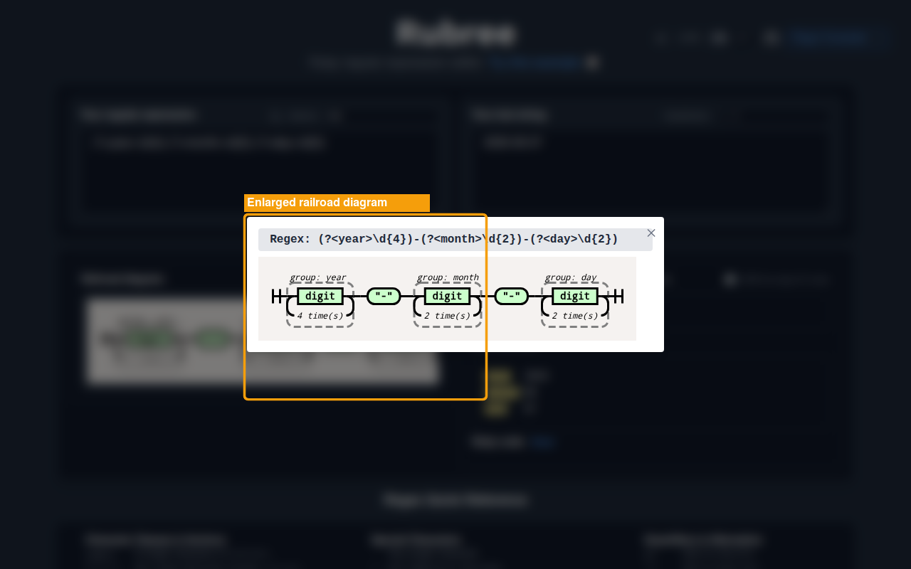

---

## 7. Substitution

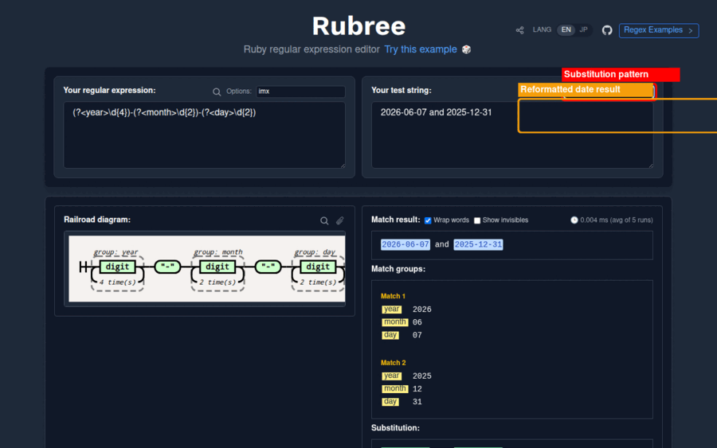

The **Substitution** field (top-right of the test string panel) supports:
- Numbered backreferences: `\1`, `\2`, …
- Named backreferences: `\k<name>`
- Literal strings mixed with backreferences

**Try it (date reformat):**
- Pattern: `(?<year>\d{4})-(?<month>\d{2})-(?<day>\d{2})`
- Test string: `2026-06-07 and 2025-12-31`
- Substitution: `\k<day>/\k<month>/\k<year>`

**Expected:** `07/06/2026 and 31/12/2025`

---

## 8. Ruby Code Snippet

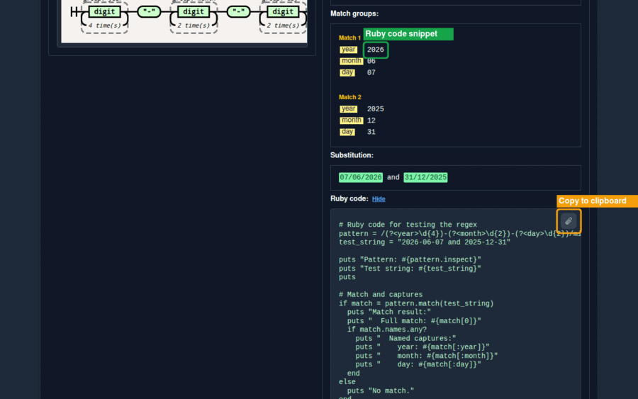

Click **Show** next to "Ruby code:" to expand an auto-generated Ruby snippet
for the current pattern, test string, and substitution. Click 📋 to copy.

**Example output:**
```ruby
pattern = /(?<year>\d{4})-(?<month>\d{2})-(?<day>\d{2})/
test_string = "2026-06-07"

if match = pattern.match(test_string)
  puts "Match result:"
  puts "  year:  #{match[:year]}"
  puts "  month: #{match[:month]}"
  puts "  day:   #{match[:day]}"
end
```

---

## 9. Regex Examples

Click the **Regex Examples >** button in the top-right header to open a panel
of pre-built patterns organised by category (Dates, URLs, Email, etc.).
Clicking an example loads it directly into the editor.

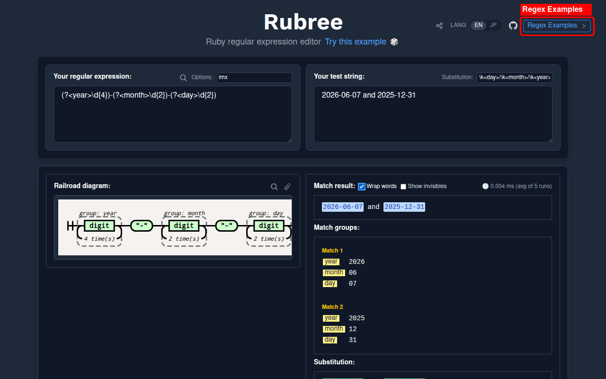

---

## 10. ReDoS Check

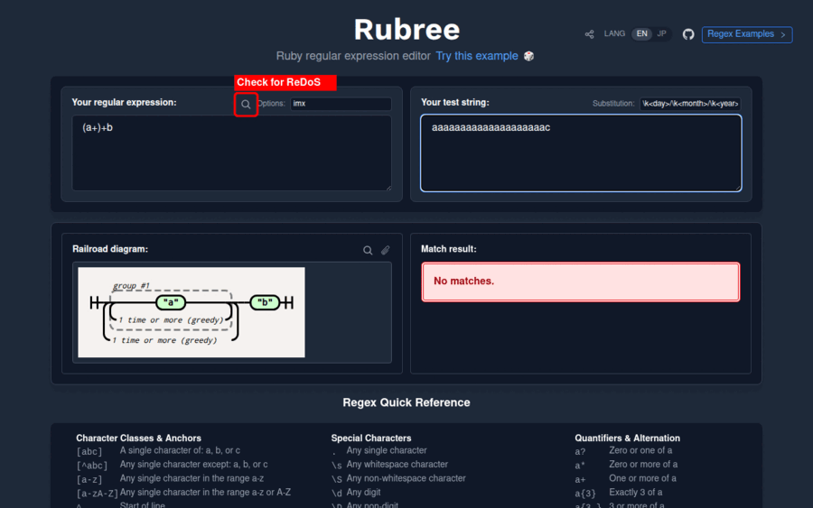

Click 🔍 (the magnifying glass icon next to "Options:") to open the
[recheck Playground](https://makenowjust-labs.github.io/recheck/) with the
current pattern pre-filled. recheck detects ReDoS (Regular Expression Denial of Service)
vulnerabilities.

**Try a vulnerable pattern:**
- Pattern: `(a+)+b`
- Test: `aaaaaaaaaaaaaaaaaaaac`

**What to verify:** The recheck Playground opens in a new tab with `(a+)+b`
pre-filled and reports `vulnerable` or `safe`.

---

## 11. Permalink / Sharing

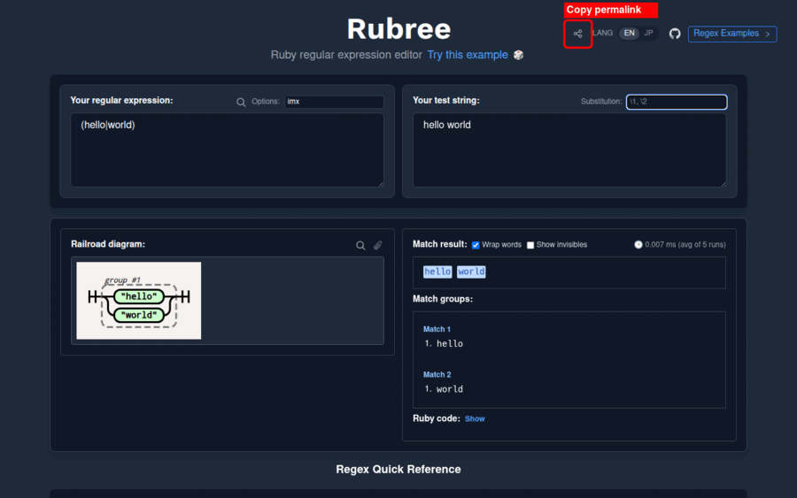

Click the **share icon** (↗) in the top-right header to encode the current
editor state (pattern, test string, options, substitution) into a URL and
copy it to the clipboard.

The URL uses a URL-safe base64 payload (`?p=<encoded>`). Visiting the link
restores the exact editor state.

---

## 12. Quick Reference

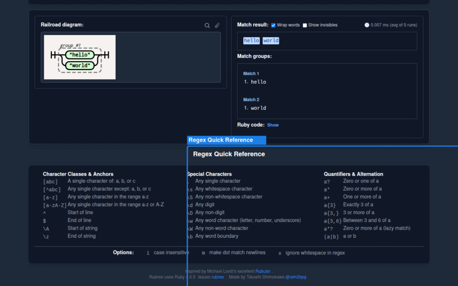

Scroll to the bottom of the page for a cheat-sheet of Ruby regex syntax —
character classes, anchors, special characters, quantifiers, and common
options explained inline.

---

## Visual Verification Checklist

Use the assets above as expected-state reference when verifying a WASM build manually.

| # | Check | Reference asset |
|---|---|---|
| 1 | Boot complete, editor ready | `features/gif_boot.gif` |
| 2 | Basic match highlights | `features/gif_match.gif` |
| 3 | Numbered capture groups | `features/gif_captures.gif` |
| 4 | Named captures (year/month/day) | `features/named_captures.png` |
| 5 | Case-insensitive option (`i`) | `features/options_case_insensitive.png` |
| 6 | Railroad diagram renders inline | `features/gif_diagram.gif` |
| 7 | Railroad diagram modal (🔍) | `features/diagram_modal.png` |
| 8 | Substitution with named backreference | `features/gif_substitution.gif` |
| 9 | Ruby code snippet (Show / copy) | `features/gif_snippet.gif` |
| 10 | ReDoS check opens recheck Playground | `features/gif_redos.gif` |
| 11 | Permalink copied to clipboard | `features/gif_permalink.gif` |
| 12 | Quick reference section visible | `features/gif_quickref.gif` |

All paths are relative to `docs/screenshots/`.
To regenerate all screenshots and GIFs after a UI change, run `/screenshot-guide`.
